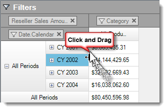

////

|metadata|
{
    "name": "rft-whats-new-in-2014-volume-2",
    "controlName": [],
    "tags": [],
    "guid": "7ed614c8-c750-4f68-bce9-222dcd60433e",  
    "buildFlags": [],
    "createdOn": "2014-10-01T14:46:55.3409901Z"
}
|metadata|
////

= What's New in 2014 Volume 2

== Topic Overview

=== Purpose

This topic presents control proxies of the new and enhanced features for the Infragistics® Test Automation for IBM ( _Rational Functional Tester_  ) for 2014 Volume 2 release.

== What’s New Summary

=== What’s new summary chart

The following table summarizes what’s new in 2014 Volume 2.

==== WinCarousel

[options="header", cols="a,a"]
|====
|Feature|Description

|New control
|Test Automation for IBM ( _Rational Functional Tester_ ) supports the _WinCarousel_ control as part of the Windows Forms product in the 2014 volume 2 release. Details about the supported _SubItems_, actions and _Verification Points_ are explained in the Related topics below. 

==== Related topics: 

* link:wincarousel.html[WinCarousel] 

|====

==== WinPivotGrid

[options="header", cols="a,a"]
|====
|Feature|Description

|Resizing row headers
|This feature in the _WinPivotGrid_ control allows runtime interaction for resizing the width of the row headers. 

|====

==== Common Features

[options="header", cols="a,a"]
|====
|Feature|Description

|Right-to-Left support
|In addition to the previous (2014.1) release, this feature adds more controls with enhancements made to support right-to-left mode for Windows Forms Test Automation 2014 volume 2. 

==== Supported controls: 

* _WinCombo_ 

* _WinDropDown_ 

* _WinGrid_ 

* _WinTree_ 

|====