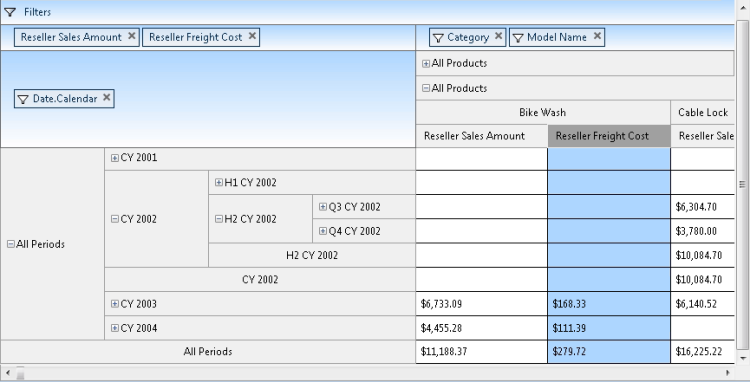
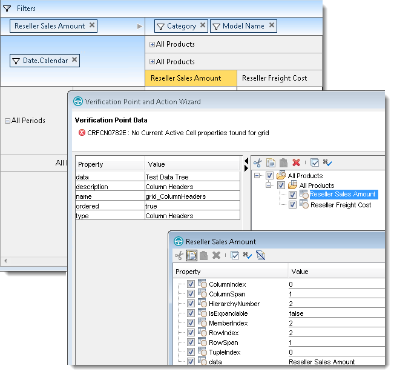
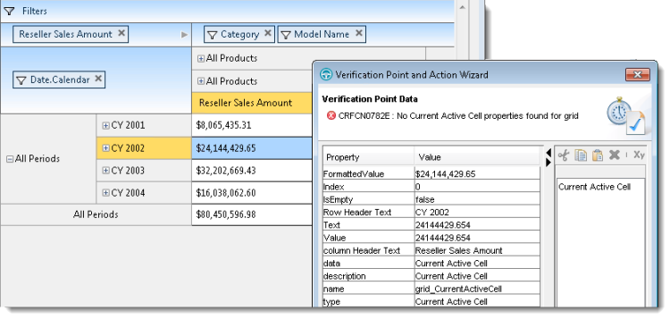

////

|metadata|
{
    "name": "winpivotgrid-using-pivotgrid-control-proxy",
    "controlName": [],
    "tags": [],
    "guid": "b1a1a142-4b3b-4d6c-99c4-af02a7c5afc7",  
    "buildFlags": [],
    "createdOn": "2014-04-12T03:38:36.6782058Z"
}
|metadata|
////

= Using PivotGrid Control Proxy

=== Purpose

This topic explains sub items, independent verification points and the behavior of the  _WinPivotGrid_™ control proxy represented by the link:infragistics.rft.nettestobjects~infragistics.rft.nettestobjects.ultrapivotgridtestobject.html[UltraPivotGridTestObject] object.

=== In this topic

This topic contains the following sections:

* <<_Ref384883011,Supported sub items>>

** <<_Ref384651967,Location sub item>>
** <<_Ref384651973,Button sub item>>
** <<_Ref384651981,Text sub item>>
** <<_Ref384651988,Cell sub item>>
** <<_Ref384651998,Row/Column headers sub item>>

* <<_Ref384883022,Supported Verification Points>>

** <<_Ref384652014,Columns>>
** <<_Ref384652021,Columns Headers>>
** <<_Ref384652030,Rows>>
** <<_Ref384652040,Rows Headers>>
** <<_Ref384652162,Table Contents>>
** <<_Ref384652171,Measures>>
** <<_Ref384652179,Filters>>
** <<_Ref384652186,Current active cell>>

* <<_Ref384831823,Supported Actions>>

** <<_Ref384883123,Resize>>
** <<_Ref384968625,Data selector>>

[[_Ref384883011]]
== Supported sub items

[[_Ref384651967]]

=== Location sub item

The different drop areas of interaction are:  _Filters_  ,  _Measures_  ,  _Rows_   and  _Columns_   all of which are recorded as `AtLocation` with the appropriate location identifier as listed below:

* `GridTable().Click(AtLocation("FilterDropArea"))`

* `GridTable().Click(AtLocation("MeasureDropArea"))`

* `GridTable().Click(AtLocation("RowDropArea"))`

* `GridTable().Click(AtLocation("ColumnDropArea"))`

image::images/Using_PivotGrid_Control_Proxy_1.png[]

[[_Ref384651973]]

=== Button sub item

There are four button types that interact with the PivotGrid and each of them is recognized as `AtButton(“[button name]”)`.

[options="header", cols="a,a"]
|====
|Button Type|Description

|Filter button
|Recorded as: `AtButton("Filter")`

|Remove button
|Recorded as: `AtButton("Remove")`

|Scroll left
|Recorded as: `AtButton("Left")`

|Scroll right
|Recorded as: `AtButton("Right")`

|Scroll button
|Recorded as: `AtButton("Sort")`

|====

image::images/Using_PivotGrid_Control_Proxy_2.png[]

[[_Ref384651981]]

=== Text sub item

Records all data source fields in the different drop area ( _Filters_  ,  _Measures_  ,  _Rows_  , and  _Columns_  ) as “`AtText”` with the column caption visible as the identifier.

.Note:
[NOTE]
====
Since each field is a child of the drop area in which it resides, the “`AtText`” sub item will be part of a list of sub-items. With the first sub item in the list represents the drop area, while the second sub item represents the clicked field.
====

==== Example 1:

In the above screenshot, clicking the “ *Model Name* ” Element in the column drop area will be recorded as:

[source,csharp]
----
GridTable().Click(AtList(AtLocation("ColumnDropArea"), AtText("Model Name")))
----

==== Example 2:

In the above screenshot, clicking on the “ *Country* ” element inside the Filter drop area will be recorded as:

[source,csharp]
----
GridTable().Click(AtList(AtLocation("FilterDropArea"), AtText("Country")))
----

==== Example 1:

Clicking the “ *Category* ” field filter button in the column drop area records as illustrated in the screenshot below:

image::images/Using_PivotGrid_Control_Proxy_3.png[]

[source,csharp]
----
GridTable().Click(AtList(AtLocation("ColumnDropArea"), AtText("Category"), AtButton("Filter")))
----

==== Example 2:

Clicking the “ *Scroll Right* ” button in the measure drop area records as illustrated below the screenshot:

image::images/Using_PivotGrid_Control_Proxy_4.png[]

[source,csharp]
----
GridTable().Click(AtList(AtLocation("MeasureDropArea"), AtButton("Right")))
----

[[_Ref384651988]]

=== Cell sub item

Records the Cells in the  _WinPivotGrid_   in the following format:

[source,csharp]
----
GridTable().Click(AtCell(AtRow(AtIndex([Row Index])), AtColumn(AtIndex([Column Index]))))
----

For example, the following script replays a click on the second cell in the first row of the PivotGrid.

[source,csharp]
----
GridTable().Click(AtCell(AtRow(0), AtColumn(1)))
----

[[_Ref384651998]]

=== Row/Column headers sub item

Records the actions on the row and column headers’ values as “AtList” sub items. The recording process begins by identifying the area as a location ( _i.e._  _,_  “`AtLocation("RowHeader")`” or “`AtLocation("ColumnHeader")`”). The next step in the recording process, based on the depth of the header hierarchy, is to add a list of nested “AtText” sub items. Finally, if performing the action over the Header element’s expansion indicator, the process adds a  *“PLUS_MINUS”*  Location sub item to the end of the list.

Consider the following script examples referencing the screenshot below.

Clicking on the expansion indicator of “ *H2 CY 20002* ” records the row header as:

[source,csharp]
----
GridTable().Click(AtList(new Subitem() { AtLocation("RowHeader"), _
            AtText("All Periods"), _
            AtText("CY 2002"), _
            AtText("H2 CY 2002"), _
            PLUS_MINUS }))
----

Clicking on the summary row header area labeled “ *CY 20002* ” records as:

[source,csharp]
----
GridTable().Click(AtList(AtLocation("RowHeader"), _
AtText("All Periods"), AtText( "CY 2002", 1)))
----

Note:{label} Adds an index to the “AtText” representing the index of the instance since the summary header has the same caption as the previous one at the same hierarchy level.

Clicking “ *Bike Wash* ” Column header element will record as:

[source,csharp]
----
GridTable().Click(AtList(AtLocation("ColumnHeader"), AtText("All Products"), AtText("All Products"), AtText("Bike Wash")))
----

[[_Ref384883022]]
== Supported verification points

[[_Ref384652014]]

=== Columns

Display a list of the data source fields added to the columns drop area using  _captions_  .

.Note:
[NOTE]
====
This  _Verification Point_   only lists the field’s  _caption_   and not its values.
====

[[_Ref384652021]]

=== Column headers

Displays column headers values in a tree structure, as illustrated in the following screenshots where  _double-clicking_   on each node opens up its property listing for each header item showing their various properties of the header items:

[[_Ref384652030]]

=== Rows

Displays a list of the data source fields added to the rows drop area using  _captions_  .

.Note:
[NOTE]
====
This  _Verification Point_   only lists the field’s  _caption_   and not its values.
====

[[_Ref384652040]]

=== Rows headers

Similar to the column header  _Verification Point_   displaying row headers items in a tree structure. Each node, when  _double-click_   opens up on each header item’s properties list showing its unique properties as illustrated in the following screenshot.

image::images/Using_PivotGrid_Control_Proxy_7.png[]

[[_Ref384652162]]

=== Table contents

This  _Verification Point_   displays cell contents in a table structure that includes column headers and the row headers values. Use the “`rowHeaders`” property to verify these values as illustrated in the following screenshot.

image::images/Using_PivotGrid_Control_Proxy_8.png[]

[[_Ref384652171]]

=== Measures

Displays a list of the data source fields added to the measures drop area using  _captions_  .

[[_Ref384652179]]

=== Filters

Displays a list of the data source fields added to the filters drop area using  _captions_  .

[[_Ref384652186]]

=== Current active cell

Displays the currently active cell’s properties, displaying the value of each individual property in the table on the left side of the Verification Point wizard window; as illustrated in the following screenshot:

[[_Ref384831823]]
== Supported actions

[[_Ref384883123]]

=== Resize

This method records the link:infragistics.rft.nettestobjects~infragistics.rft.nettestobjects.iresize~resize.html[Resize] action whenever users resize a column header, either by dragging or by double clicking the header element’s edge. The action signature is:

`Resize([Column header sub item], [new width], [new height])`

For example, the resize action in the following screenshot will be recorded as:

[source,csharp]
----
UltraPivotGrid1Table().Resize(AtList(AtLocation("ColumnHeader"), AtText("All Periods"), AtText("CY Q1")), 182, 25)
----

Before resizing

image::images/Using_PivotGrid_Control_Proxy_10.png[]

After resizing

image::images/Using_PivotGrid_Control_Proxy_11.png[]

[[_Ref384968625]]

=== Data selector

The data selector supports actions on data selector elements such as tree nodes while the dropdown buttons on the combo control are test object that record and replay actions.