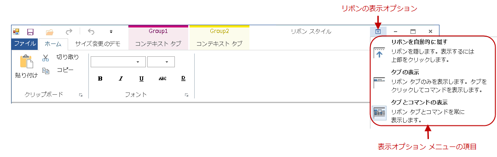

////

|metadata|
{
    "name": "rft-whats-new-in-2013-volume-2",
    "controlName": [],
    "tags": [],
    "guid": "df008b66-5e47-4d82-88f0-77686ca5f1ec",  
    "buildFlags": [],
    "createdOn": "2013-11-06T21:57:00.2792791Z"
}
|metadata|
////

= 2013 Volume 2 の新機能

== _WinLiveTileView_   プロキシ

=== 概要

_WinLiveTileView_   コントロールのTest Automation 機能には、記録、再生、プロパティ確認が含まれています。

=== サポートされるサブ項目

==== 展開/縮小ボタン

展開/縮小ボタンの操作は、`AtLocation(“ExpandCollapse”)` サブ項目として記録されます。

`TileViewPanel().Click(AtLocation("ExpandCollapse"))`

==== 水平スクロールバー (基本クラスからの継承)

水平スクロールバーの操作は、以下のように標準スクロール位置サブ項目として記録されます。

`TileViewPanel().Click(SCROLL_LEFTBUTTON)`

`TileViewPanel().Click(SCROLL_LEFT)`

`TileViewPanel().Click(SCROLL_RIGHT)`

`TileViewPanel().Click(SCROLL_RIGHTBUTTON)`

`TileViewPanel().Click(SCROLL_HORIZONTAL_ELEVATOR)`

==== グループ操作

記録と再生のためにコントロール内のグループを識別するには、以下のフォーマットを使用します。

`AtList(AtLocation(“Group”), AtIndex([グループ インデックス])`

このフォーマットは、縮小されたグループまたは展開されたグループのヘッダーに適用されます。

たとえば、以下のスクリプトは、3 番目のグループ (ゼロベースのインデックス `AtIndex(2)` を使用) が縮小される場合にクリック操作を実行します。その他の場合は、グループヘッダー領域をクリックし、5 番目のグループ (ゼロベースのインデックス `AtIndex(4)` を使用) を右クリックします。

`TileViewPanel().Click(AtList(AtLocation("Group"), AtIndex(2)))`

`TileViewPanel().Click(AtList(RIGHT, AtLocation("Group"), AtIndex(4)))`

==== タイル操作

以下のフォーマットは、タイルの識別に使用されます。

`AtList(AtLocation(“[タイルの種類]”), AtIndex([グループ インデックス], AtIndex([グループ内のタイル インデックス])`

[タイルの種類] は「Static Tile」または「Live Tile」とすることができます。

たとえば、次のスクリプトは、最初のグループの 5 番目のタイルで右クリック操作を実行します。以下の例ではライブ タイルで発生させていますが、同様に静的タイルでも簡単に実行できます。

`TileViewPanel().Click(RIGHT, AtList(AtLocation("LiveTile"), AtIndex(0), AtIndex(4)))`

=== 確認ポイント

*タイル プロパティ:*

タイル表示のグループおよびタイル構造とグループ内のタイル プロパティを含みます。

[[_Ref338260068]]
== _WinRadialMenu_   プロキシ

=== 概要

_WinRadialMenu_   コントロールのTest Automation 機能には、記録、再生、プロパティ確認が含まれています。

=== サポートされるサブ項目

==== 中央ボタン操作

中央ボタンの操作は、メニューの状態にかかわらず、AtLocation(“CenterButton”) サブ項目として記録されます。

`UltraRadialMenuFormToolBar().Click(AtLocation("CenterButton"))`

==== ツール領域操作

* ウェッジ内部でのユーザーによる操作は、以下のようなツール テキスト フォーマットを使用して記録されます。

`UltraRadialMenuFormToolBar().Click(AtText("fonts"))`

* 複数のツールが同じテキストを持つ場合、ツールはテキストとゼロベースのインデックスの組み合わせにより識別されます。たとえば、ラジアル メニューに「Edit」というテキストを持つ 3 つのツールがある場合、3 番目のツールをクリックすると、以下のように記録されます。

`UltraRadialMenuFormToolBar().Click(AtText("Edit", 2))`

再生する場合、以下を使用してツールを認識できます。

* 「AtName」などのツール キー:

`UltraRadialMenuFormToolBar().Click(AtName("fontTool"))`

* 「`AtIndex`」などの表示可能インデックス:

`UltraRadialMenuFormToolBar().Click(AtIndex(3))`

==== ツールのドリルダウン ボタン

ツール ドリルダウン ボタンの操作は、以下のように記録されます。

`AtPath(“[ツールID]$$->$$Location(DropDown)”)`

.注:
[NOTE]
====
テキストによりツールを識別する場合は、`AtPath` フォーマットのみを使用してください。名前またはインデックスを使用するには、以下のようなリスト フォーマットに切り替える必要があります。
====

`UltraRadialMenuFormToolBar().Click(AtList(AtIndex(1),DROPDOWN))`

==== 数値ゲージ ツール

数値ゲージ ツールの値を設定している場合、ゲージ トラックをクリックすると、プロキシは以下のように `Click(AtValue([整数]))` 操作を記録します。

`UltraRadialMenuFormToolBar().Click(AtValue(10))`

==== 予想される例外:

* 指定された範囲内にないなど、再生時に値が有効でない場合、プロキシは `ValueOutOfBoundsException` をスローします。
* ラジアル メニューが数値ゲージ ツールを表示しない場合は、この操作により `SubitemNotFoundException` 例外が発生します。

=== 確認ポイント

*ラジアル メニュー プロパティ* :

ラジアル メニューのプロパティには、センター ツール、メニュー設定、ツール設定が含まれます。

*ラジアル メニュー ツール* :

表示可能なラジアル メニューのツールとそのプロパティを現在のビューにリスト表示します。

=== 再生のみでサポートされる操作

==== Int GetValue()

ツールの現在の値を指定する整数を返す数値ツールの現在値を取得するには、再生専用操作の `GetValue` メソッドを使用します。このメソッドは、ラジアル メニューが数値ツールを表示しない場合に、例外 (`SubitemNotFoundException`) を生成します。値が設定されていない場合は、ゼロを返します。

`Void SetValue([整数値])`数値ツールの現在値を設定する再生専用操作。このメソッドは、ラジアル メニューが数値ツールを表示しない場合に `SubitemNotFoundException` を生成し、渡された値が有効でない場合に `ValueOutOfBoundsException` を生成します。

== _WinToolbarsManager_   (Office 2013 Ribbon) の変更点

このセクションでは、Windows Forms Test Automation 2013.2 の  _WinToolbarsManager_   コントロール プロキシの拡張機能を確認します。

=== 概要

Office 2013 Ribbon Test Automation は、ドロップダウン ボタンを使用するリボンの新しい表示オプションをサポートします。

* リボンを自動的に隠す
* タブの表示
* タブとコマンドの表示

`PopupControlToolBar().Click(AtText("Auto-hide Ribbon"))`

`PopupControlToolBar().Click(AtText("Show Tabs"))`

`PopupControlToolBar().Click(AtText("Show Tabs and Commands"))`

=== サポートされるサブ項目

==== UltraToolbarsDockAreaProxy

既存の  _UltraToolbarsDockAreaProxy_   プロキシと  _PopupMenuControlProxy_   プロキシに対して以下のサブ項目が追加されています。

`Office2013RibbonForm_Toolbars().Click(AtLocation("RibbonAutoHideBar"))`

`Office2013RibbonForm_Toolbars().Click(AtLocation("Ribbon_DisplayOptions"))`

`Office2013RibbonForm_Toolbars().Click(AtLocation("RibbonToggleButton"))`

image::images/WinForms_Test_Automation_RFT_2.png[]

image::images/WinForms_Test_Automation_RFT_3.png[]