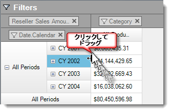

////

|metadata|
{
    "name": "rft-whats-new-in-2014-volume-2",
    "controlName": [],
    "tags": [],
    "guid": "7ed614c8-c750-4f68-bce9-222dcd60433e",  
    "buildFlags": [],
    "createdOn": "2014-10-01T14:46:55.3409901Z"
}
|metadata|
////

= 2014 Volume 2 の新機能

== トピックの概要

=== 目的

このトピックは、Infragistics® Test Automation for IBM ( _Rational Functional Tester_  ) for 2014 Volume 2 の新しい機能および拡張機能のコントロール プロキシについて説明します。

== 新機能の概要

=== 新機能の概要表

以下の表は 2014 Volume 2 の新機能の概要を提供します。

==== WinCarousel

[options="header", cols="a,a"]
|====
|機能|説明

|新規コントロール
|Test Automation for IBM ( _Rational Functional Tester_ ) は、Windows Forms 2014 Volume 2 製品の一部として _WinCarousel_ コントロールをサポートします。サポートされる _SubItems_ 、操作および _Verification Points_ については、関連トピックで説明します。

==== 関連するトピック: 

* link:wincarousel.html[WinCarousel] 

|====

==== WinPivotGrid

[options="header", cols="a,a"]
|====
|機能|説明

|行ヘッダーのサイズ変更
|_WinPivotGrid_ コントロールのこの機能は、行ヘッダーの幅のサイズ変更をランタイムで操作できます。 

|====

==== 共通機能

[options="header", cols="a,a"]
|====
|機能|説明

|右から左サポート
|この機能は、Windows Forms Test Automation 2014 volume 2 で右から左サポート モードが前回の 2014 Volume 1 に比べ更に拡張されています。 

==== サポートされるコントロール: 

* _WinCombo_ 

* _WinDropDown_ 

* _WinGrid_ 

* _WinTree_ 

|====