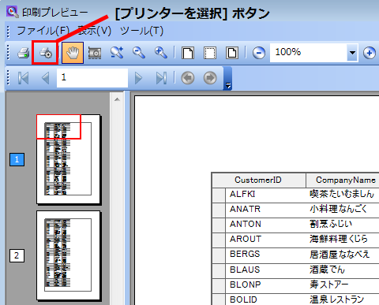

////

|metadata|
{
    "name": "whats-new-whats-new-in-2015-volume-1",
    "controlName": [],
    "tags": [],
    "guid": "e3e0019b-bc79-421a-ba3e-853a97b882f0",  
    "buildFlags": [],
    "createdOn": "2015-04-01T18:56:33.2197745Z"
}
|metadata|
////

= 2015 Volume 1 の新機能

== トピックの概要

=== 目的

このトピックは、Infragistics® Test Automation for IBM ( _Rational Functional Tester_  ) for 2015 Volume 1 の新しい機能および拡張機能のコントロール プロキシについて説明します。

== 新機能の概要

=== 新機能の概要表

以下の表は 2015 Volume 1 の新機能の概要を示します。

==== WinGrid

[options="header", cols="a,a"]
|====
|機能|説明

|ColumnChooser MultiSelect
|UltraWinGrid の列選択ダイアログで複数の列を選択する機能を追加しました。

|====

==== 印刷プレビュー ダイアログ

[options="header", cols="a,a"]
|====
|機能|説明

|[プリンターを選択] ボタン
|印刷プレビュー ダイアログに [プリンターを選択] ボタンを追加しました。このボタンは Windows プリンター セットアップ ダイアログを開きます。 

|====

==== 共通機能

[options="header", cols="a,a"]
|====
|機能|説明

|双方向サポート
|以前のリリース (2014.1 - 2014.2) でのサポートに加え、右から左モードのサポートを他のコントロールにも追加しました。 

==== サポートされるコントロール: 

* WinExplorerBar 

|====