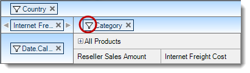
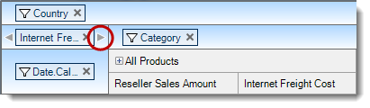
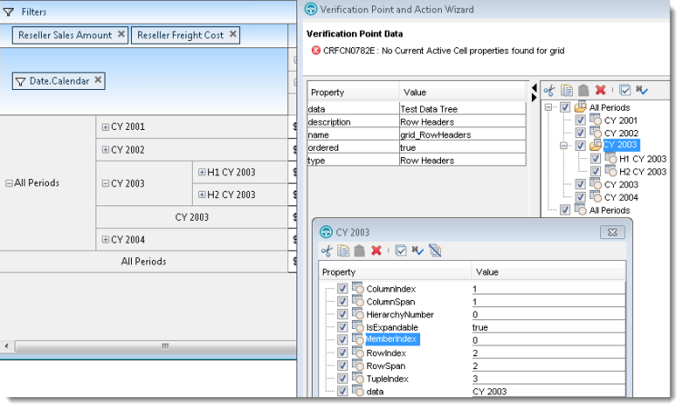
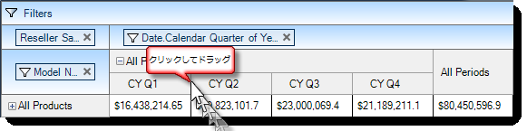

////

|metadata|
{
    "name": "winpivotgrid-using-pivotgrid-control-proxy",
    "controlName": [],
    "tags": [],
    "guid": "b1a1a142-4b3b-4d6c-99c4-af02a7c5afc7",  
    "buildFlags": [],
    "createdOn": "2014-04-12T03:38:36.6782058Z"
}
|metadata|
////

= PivotGrid コントロール プロキシーの使用

== _______WinPivotGrid_______ コントロール プロキシーの使用

=== 目的

このトピックは、 link:infragistics.rft.nettestobjects~infragistics.rft.nettestobjects.ultrapivotgridtestobject.html[UltraPivotGridTestobject] オブジェクトによって表される  _WinPivotGrid_ ™ コントロール プロキシーのサブ項目、独立した確認ポイント、および動作について説明します。

=== このトピックの内容

このトピックは、以下のセクションで構成されます。

* <<_Ref384883011,サポートされるサブ項目>>

** <<_Ref384651967,サブ項目の位置>>
** <<_Ref384651973,ボタンサブ項目>>
** <<_Ref384651981,テキスト サブ項目>>
** <<_Ref384651988,セル サブ項目>>
** <<_Ref384651998,行/列ヘッダー サブ項目>>

* <<_Ref384883022,サポートされる確認ポイント>>

** <<_Ref384652014,列>>
** <<_Ref384652021,列ヘッダー>>
** <<_Ref384652030,行>>
** <<_Ref384652040,行ヘッダー>>
** <<_Ref384652162,テーブル コンテンツ>>
** <<_Ref384652171,メジャー>>
** <<_Ref384652179,フィルター>>
** <<_Ref384652186,現在のアクティブ セル>>

* <<_Ref384831823,サポートされる操作>>

** <<_Ref384883123,サイズ変更>>
** <<_Ref384968625,データ セレクター>>

[[_Ref384883011]]
== サポートされるサブ項目

[[_Ref384651967]]

=== サブ項目の位置

インタラクションのドロップ領域は、 _Filters_  ,  _Measures_  ,  _Rows_   および  _Columns_   があります。すべて `AtLocation` として以下の適切な位置識別子で記録されます。

* `GridTable().Click(AtLocation("FilterDropArea"))`

* `GridTable().Click(AtLocation("MeasureDropArea"))`

* `GridTable().Click(AtLocation("RowDropArea"))`

* `GridTable().Click(AtLocation("ColumnDropArea"))`

image::images/Using_PivotGrid_Control_Proxy_1.png[]

[[_Ref384651973]]

=== ボタンサブ項目

PivotGrid とインタラクションするボタン タイプは 4 種類あり、各ボタンは `AtButton(“[button name]”)` として認識されます。

[options="header", cols="a,a"]
|====
|ボタン タイプ|説明

|フィルター ボタン
|次で記録: `AtButton("Filter")`

|削除ボタン
|次で記録: `AtButton("Remove")`

|左スクロール
|次で記録: `AtButton("Left")`

|右スクロール
|次で記録: `AtButton("Right")`

|スクロール ボタン
|次で記録: `AtButton("Sort")`

|====

image::images/Using_PivotGrid_Control_Proxy_2.png[]

[[_Ref384651981]]

=== テキスト サブ項目

異なるドロップ領域 ( _Filters_  ,  _Measures_  ,  _Rows_  , and  _Columns_  ) ですべてのデータ ソース フィールドを表示される列キャプションの識別子で `AtText”` として記録します。

.注:
[NOTE]
====
各フィールドはそのドロップ領域の子であるため、`AtText` サブ項目がサブ項目リストの一部になります。リストの最初のサブ項目がドロップ領域を表し、2 つめのサブ項目がクリックされたフィールドを表します。
====

==== 例 1:

上記のスクリーン ショットの列ドロップ領域で  *Model Name*  要素をクリックすると次のように記録されます。

[source,csharp]
----
GridTable().Click(AtList(AtLocation("ColumnDropArea"), AtText("Model Name")))
----

==== 例 2:

上記のスクリーン ショットのフィルター ドロップ領域で  *Country*  要素をクリックすると次のように記録されます。

[source,csharp]
----
GridTable().Click(AtList(AtLocation("FilterDropArea"), AtText("Country")))
----

==== 例 1:

列ドロップ領域の  *Category*  フィールド フィルター ボタンをクリックすると以下のスクリーン ショットのように記録されます。

[source,csharp]
----
GridTable().Click(AtList(AtLocation("ColumnDropArea"), AtText("Category"), AtButton("Filter")))
----

==== 例 2:

メジャー ドロップ領域の  *Scroll Right*  ボタンをクリックすると以下のスクリーン ショットのように記録されます。

[source,csharp]
----
GridTable().Click(AtList(AtLocation("MeasureDropArea"), AtButton("Right")))
----

[[_Ref384651988]]

=== セル サブ項目

以下の書式で  _WinPivotGrid_   のセルを記録します。

[source,csharp]
----
GridTable().Click(AtCell(AtRow(AtIndex([Row Index])), AtColumn(AtIndex([Column Index]))))
----

たとえば、以下のスクリプトは PivotGrid の最初の行の 2 番目のセル クリックを再生します。

[source,csharp]
----
GridTable().Click(AtCell(AtRow(0), AtColumn(1)))
----

[[_Ref384651998]]

=== 行/列ヘッダー サブ項目

行および列ヘッダーの値の操作を AtList サブ項目として記録します。記録処理は (`AtLocation("RowHeader")` または `AtLocation("ColumnHeader")`) の領域を識別することから始まります。記録処理の次の処理は、ヘッダー階層の深さに基づき、階層 AtText サブ項目のリストに追加されます。最後にヘッダー要素の展開インジケーターを操作する場合、処理は  *“PLUS_MINUS”*  Location サブ項目をリストの最後に追加します。

以下のスクリプト例はスクリーンショットを参照してください。

*H2 CY 20002*  の展開インジケーターをクリックすると行ヘッダーを次のように記録します。

[source,csharp]
----
GridTable().Click(AtList(new Subitem() { AtLocation("RowHeader"), _
            AtText("All Periods"), _
            AtText("CY 2002"), _
            AtText("H2 CY 2002"), _
            PLUS_MINUS }))
----

ラベルが  *CY 20002*  の概要行ヘッダー領域をクリックすると次のように記録します。

[source,csharp]
----
GridTable().Click(AtList(AtLocation("RowHeader"), _
AtText("All Periods"), AtText( "CY 2002", 1)))
----

注:{label} 概要ヘッダーに同じ階層レベルの以前のキャプションと同じキャプションがあるため、インスタンスのインデックスを表す AtText に追加します。

Bike Wash 列ヘッダー要素をクリックすると次のように記録されます。

[source,csharp]
----
GridTable().Click(AtList(AtLocation("ColumnHeader"), AtText("All Products"), AtText("All Products"), AtText("Bike Wash")))
----

image::images/Using_PivotGrid_Control_Proxy_5.png[]

[[_Ref384883022]]
== サポートされる確認ポイント

[[_Ref384652014]]

=== 列

データ ソース フィールドのリストを  _キャプション_   を使用する列ドロップ領域に表示します。

.注:
[NOTE]
====
この  _確認ポイント_   はフィールドの _キャプション_  のみを一覧にし、その値は含まれません。
====

[[_Ref384652021]]

=== 列ヘッダー

ツリー構造の列ヘッダー値を表示します。以下のスクリーンショットは、各ノードをダブルクリックして各ヘッダー項目のプロパティを開き、ヘッダー項目のさまざまなプロパティを表示しています。

image::images/Using_PivotGrid_Control_Proxy_6.png[]

[[_Ref384652030]]

=== 行

データ ソース フィールドのリストを  _キャプション_   を使用する行ドロップ領域に表示します。

.注:
[NOTE]
====
この  _確認ポイント_   はフィールドの _キャプション_  のみを一覧にし、その値は含まれません。
====

[[_Ref384652040]]

=== 行ヘッダー

列ヘッダー _確認ポイント_  のように行ヘッダー項目をツリー構造に表示します。 以下のスクリーン ショットは、各ノードを _ダブルクリック_  して各ヘッダー項目のプロパティ リストを開き、一意なプロパティを表示しています。

[[_Ref384652162]]

=== テーブル コンテンツ

この _確認ポイント_   は、列ヘッダーおよび行ヘッダー値を含むテーブル構造にセル コンテンツを表示します。以下のスクリーンショットは `rowHeaders` プロパティを使用してこれらの値を確認しています。

image::images/Using_PivotGrid_Control_Proxy_8.png[]

[[_Ref384652171]]

=== メジャー

データ ソース フィールドのリストを  _キャプション_   を使用するメジャー ドロップ領域に表示します。

[[_Ref384652179]]

=== フィルター

データ ソース フィールドのリストを  _キャプション_   を使用するフィルター ドロップ領域に表示します。

[[_Ref384652186]]

=== 現在のアクティブ セル

現在のアクティブなセルのプロパティを表示します。確認ポイント ウィザード ウィンドウの左側にあるテーブルの各プロパティの値を表します。

image::images/Using_PivotGrid_Control_Proxy_9.png[]

[[_Ref384831823]]
== サポートされる操作

[[_Ref384883123]]

=== サイズ変更

このメソッドは、ユーザーがヘッダー要素の端をドラッグまたはダブルクリックして列ヘッダーのサイズを変更した際に link:infragistics.rft.nettestobjects~infragistics.rft.nettestobjects.iresize~resize.html[Resize] アクションを記録します。操作

`Resize([Column header sub item], [new width], [new height])`

たとえば、以下のスクリーンショットのサイズ変更操作は次のように記録されます。

[source,csharp]
----
UltraPivotGrid1Table().Resize(AtList(AtLocation("ColumnHeader"), AtText("All Periods"), AtText("CY Q1")), 182, 25)
----

サイズ変更前

サイズ変更後

image::images/Using_PivotGrid_Control_Proxy_11.png[]

[[_Ref384968625]]

=== データ セレクター

データ セレクターは、ツリー ノードなどのデータ セレクター要素上での操作をサポートします。コンボ コントロールのドロップダウン ボタンは記録および再生操作のテスト オブジェクトです。