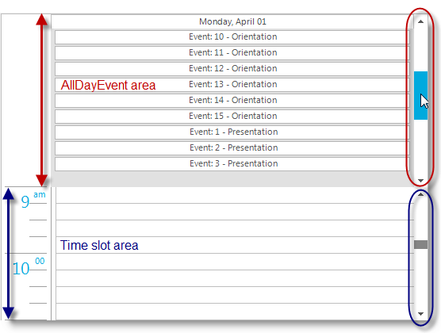

////

|metadata|
{
    "name": "rft-whats-new-in-2013-volume-1",
    "controlName": [],
    "tags": [],
    "guid": "ae4122b2-7740-4d3a-97ba-a54bdac63e43",  
    "buildFlags": [],
    "createdOn": "2013-03-21T19:09:55.2909194Z"
}
|metadata|
////

= What's New in 2013 Volume 1

== Support for Ultimate UI for Windows Forms 2013 Volume 1

=== All Windows Forms controls

In Ultimate UI for Windows Forms 2013 volume 1, all windows forms controls will be supported in {ProductName} (Rational Functional Tester) version 8.1.

== _UltraDayView_   Control Proxy

=== Click to Add functionality

The “ *Click To Add* ” functionality has been added as a sub-item to the  _UltraDayView_   control proxy and allows you to record an action by clicking on the button, located on a day view, to add an appointment.

Clicking the “ *Click to Add* ” button on a time slot will record the action as:

[source,csharp]
----
UltraDayView1Calendar().Click(AtList( _
AtLocation("AddAppointment"), _
       AtLocation("TimeSlot"), _
       AtPosition(34), AtDate( _
       12, 26, 2012)))
----

Clicking the “ *Click to Add* ” button on `AllDayEventArea` will record the action as:

[source,csharp]
----
UltraDayView1Calendar().Click(AtList( _
AtLocation("AddAppointment"), _
AtLocation("AllDayAppointmentArea "), _
AtDate( _
12, 26, 2012)))
----

=== AllDayEvent area scrollbars

In addition to the day view scrollbars the  _UltraDayView_   control allows the scrollbars to display in `AllDayEvent` area via the `AllDayEventAreaScrolling` property.

When both scrollbars are set to display, interacting with `AllDayEvent` scrollbars will record a specific action for `AllDayEvent` area distinguishing it from the time slot area scrollbars.

*In C#:*

[source,csharp]
----
UltraDayView1Calendar().Click(AtLocation("AllDay_SCROLL_DOWNBUTTON"))
UltraDayView1Calendar().Click(AtLocation("AllDay_SCROLL_DOWN"))
UltraDayView1Calendar().Click(AtLocation("AllDay_SCROLL_UPBUTTON"))
UltraDayView1Calendar().Click(AtLocation("AllDay_SCROLL_UP"))
UltraDayView1Calendar().Click(AtLocation("AllDay_SCROLL_VERTICAL_ELEVATOR"))
----

The following screenshot outlines the `AllDayEvent` area scrollbars separate from the time slot area scrollbars.

== _UltraGanttView_   Control Proxy

=== New Properties

The following properties have been added to the  _UltraGanttView_   control proxy.

[options="header", cols="a,a"]
|====
|Property|Description

|`Active Cell Properties`
|Property verification for the active cell.

|`Active Cell Column`
|Property verification for the active cell’s column.

|`All Data`
|Grid view (as a flat band) verification of the control with all visible rows and columns.

|====