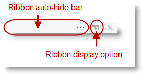

////

|metadata|
{
    "name": "rft-whats-new-in-2013-volume-2",
    "controlName": [],
    "tags": [],
    "guid": "df008b66-5e47-4d82-88f0-77686ca5f1ec",  
    "buildFlags": [],
    "createdOn": "2013-11-06T21:57:00.2792791Z"
}
|metadata|
////

= What's New in 2013 Volume 2

== _WinLiveTileView_   Proxy

=== Overview

Test Automation capabilities of the  _WinLiveTileView_™ control including record, replay, and property verification.

=== Supported Sub-Items

==== Expand/Collapse Button

Interacting with the Expand/Collapse button are recorded as `AtLocation(“ExpandCollapse”)` sub-item.

`TileViewPanel().Click(AtLocation("ExpandCollapse"))`

==== Horizontal scroll bar (inherited from Base class)

User interactions with the horizontal scroll bar are recorded as standard scroll location sub-item as following:

`TileViewPanel().Click(SCROLL_LEFTBUTTON)`

`TileViewPanel().Click(SCROLL_LEFT)`

`TileViewPanel().Click(SCROLL_RIGHT)`

`TileViewPanel().Click(SCROLL_RIGHTBUTTON)`

`TileViewPanel().Click(SCROLL_HORIZONTAL_ELEVATOR)`

==== Groups interaction

Use the following format to identify groups within the control for record and replay purposes

`AtList(AtLocation(“Group”), AtIndex([group index])`

The format applies to either a collapsed group or the header of an expanded group

For example, the following script performs a click action at the third group (using zero-based index `AtIndex(2)`) if it is collapsed, otherwise it clicks on the group header area, and then right-clicking on the Fifth (using zero-based index `AtIndex(4)`) group:

`TileViewPanel().Click(AtList(AtLocation("Group"), AtIndex(2)))`

`TileViewPanel().Click(AtList(RIGHT, AtLocation("Group"), AtIndex(4)))`

==== Tiles interaction

The following format is used to identify tiles:

`AtList(AtLocation(“[TileType]”), AtIndex([group index], AtIndex([Tile Index within the group])`

“Tile type” could be “Static Tile” or “Live Tile”.

For example the following script performs a right-click action at the fifth tile in the first group, while this happens to be a live tile for this example, it could just as easily be a static tile:

`TileViewPanel().Click(RIGHT, AtList(AtLocation("LiveTile"), AtIndex(0), AtIndex(4)))`

=== Verification points

*Tiles Properties:*

Includes the Tile view’s groups and tiles structure along with the tiles’ properties within a group.

[[_Ref338260068]]
== _WinRadialMenu_   Proxy

=== Overview

Test Automation capabilities of the  _WinRadialMenu_™ control includes record, replay, and property verification.

=== Supported sub-items

==== Center button interaction

Interacting with the center button, regardless of the state of the menu, will be recorded as AtLocation(“CenterButton”) Subitem

`UltraRadialMenuFormToolBar().Click(AtLocation("CenterButton"))`

==== Tool area interaction

* User interactions with the Inner part of the wedge will be recorded using the tool text format such as:

`UltraRadialMenuFormToolBar().Click(AtText("fonts"))`

* In case of multiple tools with the same text, tools are identified by a combination of text and instant zero-based Index for example if the Radial menu include 3 tools that have the text “Edit” then clicking on the third one will record as:

`UltraRadialMenuFormToolBar().Click(AtText("Edit", 2))`

For replay purpose, users can identify tools using:

* tool key as “AtName”:

`UltraRadialMenuFormToolBar().Click(AtName("fontTool"))`

* Visible index as “`AtIndex”`:

`UltraRadialMenuFormToolBar().Click(AtIndex(3))`

==== Tool’s drilldown button

User interaction on any tool drilldown button will be recorded as:

`AtPath(“[Tool identifer]$$->$$Location(DropDown)”)`

.Note:
[NOTE]
====
Only use the `AtPath` format when identifying a tool by its text. Using the name or index requires you to switch to list format such as:
====

`UltraRadialMenuFormToolBar().Click(AtList(AtIndex(1),DROPDOWN))`

==== Numeric gauge tool

Clicking on the gauge track when the user sets the value of the numeric gauge tool the proxy records `Click(AtValue([int]))` action as follow:

`UltraRadialMenuFormToolBar().Click(AtValue(10))`

==== Expected exception:

* When replayed, if the value is not valid (i.e., not within the specified range) the proxy will throw a `ValueOutOfBoundsException`
* If the Radial menu does not display the numeric gauge tool, the action will generate an exception `SubitemNotFoundException`

=== Verification points

*Radial Menu Properties* :

Includes properties on the radial menu, Center Tool, Menu Settings, and Tool Settings.

*Radial Menu Tools* :

Lists the visible radial menu’s tools in the current view along with their properties.

=== Replay only supported actions

==== Int GetValue()

Use the `GetValue` method, a replay only action, to retrieve the current value of the numeric tool returns an integer specifying the current value of the tool. The method generates an exception (`SubitemNotFoundException`) if the radial menu does not show the numeric tool. If the value is not set, the method returns zero.

`Void SetValue(int value)`A replay only action to set the current value of the numeric tool. The method will generate a `SubitemNotFoundException` if the radial menu does not show the numeric tool and `ValueOutOfBoundsException` if the passed in value is not valid.

== _WinToolbarsManager_   (Office 2013 Ribbon) changes

This section explains the changes made to the  _WinToolbarsManager_™ control proxy for Windows Forms Test Automation 2013.2.

=== Overview

The Office 2013 Ribbon test automation supports new display options for ribbons using a dropdown button.

* Auto-Hide Ribbon
* Show Tabs
* Show Tabs and Commands

`PopupControlToolBar().Click(AtText("Auto-hide Ribbon"))`

`PopupControlToolBar().Click(AtText("Show Tabs"))`

`PopupControlToolBar().Click(AtText("Show Tabs and Commands"))`

image::images/WinForms_Test_Automation_RFT_1.png[]

=== Supported sub-items

==== UltraToolbarsDockAreaProxy

Added the following sub-items to the existing  _UltraToolbarsDockAreaProxy_   and  _PopupMenuControlProxy_   proxy:

`Office2013RibbonForm_Toolbars().Click(AtLocation("RibbonAutoHideBar"))`

`Office2013RibbonForm_Toolbars().Click(AtLocation("Ribbon_DisplayOptions"))`

`Office2013RibbonForm_Toolbars().Click(AtLocation("RibbonToggleButton"))`

image::images/WinForms_Test_Automation_RFT_3.png[]